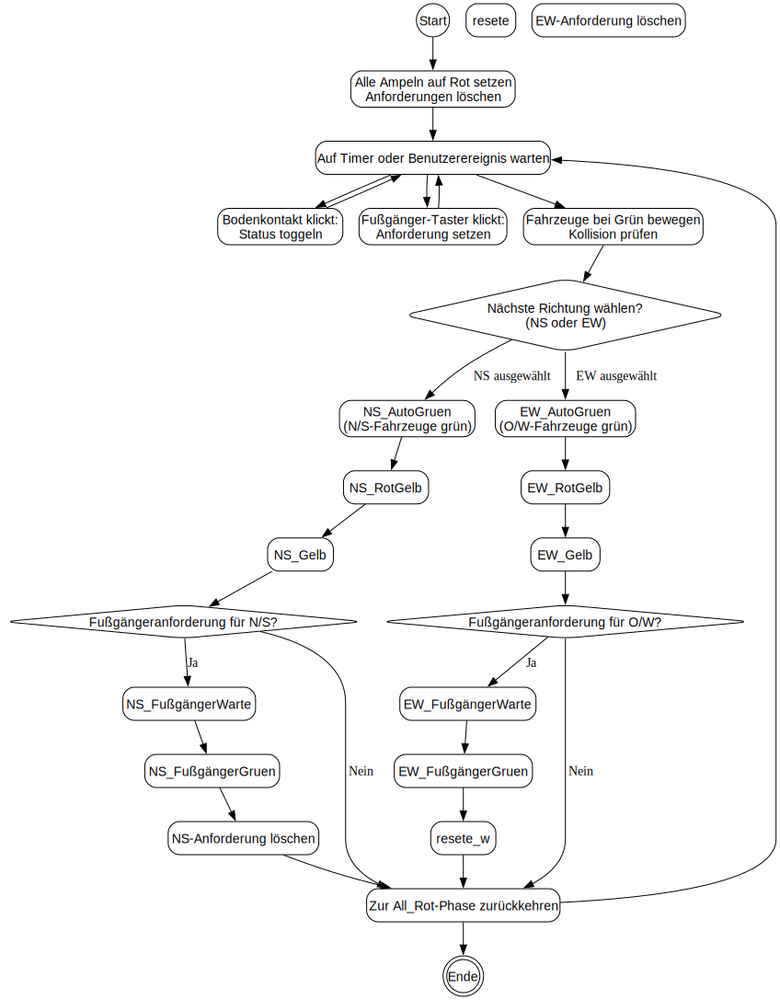

# Aktivitätsdiagramm zur FSD Ampelsteuerung

Dieses Diagramm fasst die Phasensteuerung der Ampelsteuerung zusammen und bildet die wichtigsten Aktionen, Entscheidungen und Schleifen ab.

```mermaid
flowchart TD
    Start((Start))
    Init[Alle Ampeln auf Rot setzen\nAnforderungen löschen]
    Wait[Auf Timer oder Benutzerereignis warten]
    Input1[Wenn Bodenkontakt klickt:\nStatus toggeln]
    Input2[Wenn Fußgänger-Taster klickt:\nForderung setzen]
    UpdateVehicles[Fahrzeuge bei Grün bewegen\nKollision prüfen]

    ChooseDir{Nächste Richtung wählen?\n(NS oder EW)}
    NSAuto[NS_AutoGruen]\n(Nord/Süd Fahrzeuge grün)
    NSRotGelb[NS_RotGelb]
    NSGelb[NS_Gelb]
    CheckNS{Fußgängeranforderung\nfür Nord/Süd vorhanden?}
    NSFWait[NS_FussgaengerWarte]
    NSFGreen[NS_FussgaengerGruen]
    ResetNS[NS-Anforderung löschen]

    EWAuto[EW_AutoGruen]\n(Ost/West Fahrzeuge grün)
    EWRotGelb[EW_RotGelb]
    EWGelb[EW_Gelb]
    CheckEW{Fußgängeranforderung\nfür Ost/West vorhanden?}
    EWFWait[EW_FussgaengerWarte]
    EWFGreen[EW_FussgaengerGruen]
    ResetEW[EW-Anforderung löschen]

    BackToAll[Zur All_Rot-Phase zurückkehren]
    End((Ende))

    Start --> Init --> Wait
    Wait --> Input1
    Wait --> Input2
    Input1 --> Wait
    Input2 --> Wait
    Wait --> UpdateVehicles
    UpdateVehicles --> ChooseDir

    ChooseDir -->|NS ausgewählt| NSAuto
    ChooseDir -->|EW ausgewählt| EWAuto

    NSAuto --> NSRotGelb --> NSGelb --> CheckNS
    CheckNS -->|Ja| NSFWait --> NSFGreen --> ResetNS --> BackToAll
    CheckNS -->|Nein| BackToAll

    EWAuto --> EWRotGelb --> EWGelb --> CheckEW
    CheckEW -->|Ja| EWFWait --> EWFGreen --> ResetEW --> BackToAll
    CheckEW -->|Nein| BackToAll

    BackToAll --> Wait

    %% Optionaler End-Knoten für Abbruch
    BackToAll --> End
```



## Warum dieses Diagramm?
- Start- und Endpunkte sind klar definiert.
- Entscheidungsknoten zeigen, wann Fußgängerphasen eingeschoben werden.
- Die Hauptphasen der Ampelsteuerung (`NS_AutoGruen`, `NS_RotGelb`, `NS_Gelb`, `EW_AutoGruen` usw.) sind in der Reihenfolge des FSD dargestellt.
- Benutzerereignisse (Bodenkontakte, Fußgängertaster) werden als Input-Aktivitäten dargestellt.
- Fahrzeugbewegung und Kollisionsprüfung laufen im Hintergrund und werden vor der Phasenwahl aktualisiert.

## Gute Aktivitätsdiagramm-Prinzipien, die hier angewendet wurden
- Klare Trennung von Aktionen (`Rechtecke`) und Entscheidungen (`Rauten`).
- Beschriftungen kurz und aussagekräftig.
- Wiederholende Abläufe als Schleife (`BackToAll --> Wait`).
- Fokus auf den Kontrollfluss statt auf Implementierungsdetails.
- Reduzierung von unnötigen Verzweigungen: NS- und EW-Zweige sind symmetrisch aufgebaut.
